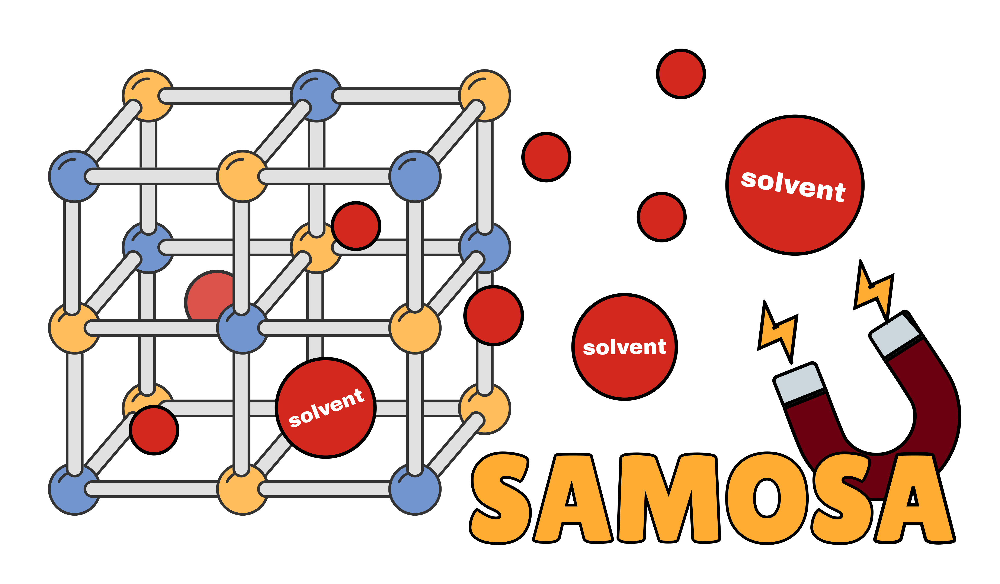

# SAMOSA

[](https://doi.org/10.1021/acs.jcim.4c01897)

[](https://black.readthedocs.io/en/stable/)

<p align="center">
    
</p>

Structural Activation via Metal Oxidation State Analysis. A solvent removal protocol generating activated crystal structures from experimental crystallographic information.

This program was designed to clean CIF files of Metal-Organic Frameworks (MOFs) from free solvents, counterions and bound solvents keeping into account the charge of removed fragments.

## Installation
This code requires [CSD Python API](https://www.ccdc.cam.ac.uk/solutions/csd-core/components/csd-python-api/), which must be installed separately according to their [installation instructions](https://downloads.ccdc.cam.ac.uk/documentation/API/installation_notes.html).

Additional dependencies:
 - mendeleev

## Input file requirements
Program was designed to work with experimental crystal structures in the CIF file format.
The following additional suggestions regarding the input structural data improve the success of the solvent removal algorithm:
 - **Filename in format REFCODE.cif or REFCODE_xxx.cif** (the script accesses CSD to determine presence of terminal oxygens). With invalid refcode, certain aspects of the materials-specific criteria are impossible thus all terminal oxygens will be removed.
 - **P1 symmetry** (Convert your experimental crystal structures to 'P1' using Materials Studio or using the following [code](https://github.com/uowoolab/CSD-cleaner) prior to use of SAMOSA)
 - **Periodic structure** (Presence of bonds crossing the periodic boundaries is assumed in this method)

## Example — running SAMOSA

```
cd <path to SAMOSA folder>
python main.py --files_path <path to folder containing crystal structures> --export_path <path to folder to write processed crystal structures>
```

## Optional arguments

| Argument | Description | Default |
| -------------- | -------------- | -------------- |
| `--files_path` | Provide the path to the folder with input MOFs | cwd |
| `--export_path` | Provide path to the output folder | cwd |
| `--n_processes` | Specify number of processes for parallelization | 4 |
| `--removable_denticity` | Specify the maximum ligand denticity that may be removed | monodentate (1) |
| `--verbose`,`-v` | Enable command line output | - |
| `--keep_bound` | Enable to retain bound solvent molecules | - |
| `--keep_oxo` | Enable to retain all terminal oxygens | - |
| `--logging` | Specify the desired level of logging | INFO |

## Outputs
**MOFs_removed_solvent folder** contains all the edited structures that had solvent removed

If --keep_bound - **Free_solvent_removal_results.csv** - description of columns:

 - **CIF** - Filename
 - **Solvent** - YES or NO if no solvent identified
 - **Free_solvent** - list of atoms grouped by molecules in free solvent
 - Number of free solvent molecules
 - **Counterions** - list of atoms grouped by molecules in counterions (charged fragments)
 - **Number_of_counterions**
 - **Charge_removed** - total charge removed from structure, can be positive, negative or 0
 - **Total_atoms** - total atoms detected as solvent
 - **Atoms_removed** - total atoms removed from CIF by the parcer
 - **atoms_match_flag** - TRUE if the cif parcer left out any atoms -> Total atoms and Atoms removed don't match
 - **Metal_counterion_flag** - TRUE if identified counterion that contains metals -> higher chance of wrong charge assignment
 - **Huge_counterion_flag** - TRUE if there are structures with counterions with a lot of metals and high mass that the code fails to assign charges to

If all solvent should be removed - **Solvent_removal_results.csv** - additional columns:

 - **Bound_solvent** -  list of atoms grouped by molecules in bound solvent
 - **Number_of_bound_molecules**
 - **Flag_double** - flags if there are double bonds near the binding cite
 - **Flag_aromatic** - flags if there are aromatic solvents removed
 - **Terminal_oxo_flag** - flags if oxo atoms were removed
 - **Entry_terminal_oxo** - the script checks the CSD entry to determine if there are terminal oxygens in the structure. True if terminal oxo is present in the entry, FAILED REFCODE if the refcode in the filename wasn't found in the CSD
 - **OH_removed** - the code removes OH bound to the metals because statistically they are most often water with missing hydrogens.
If it does so, it flags the molecule so you can check If it is actually OH or water with missing H
 - **Oxo_OH** - identifies terminal oxo atoms that likely can be OH or water on the atoms that can have those issues (U and Zr)

**samosa.log** contains all the log messages for the parent and child processes.

## Licensing
The [GNU General Public License v3.0](https://www.gnu.org/licenses/gpl-3.0.en.html) applies to the utilization of the SAMOSA solvent removal code. Follow the license guidelines regarding the use, sharing, adaptation, and attribution of this data.

## Citation
When using SAMOSA, please cite the following publication:

- Gibaldi, M., Kapeliukha, A., White, A. & Woo, T. Incorporation of ligand charge and metal oxidation state considerations into the computational solvent removal and activation of experimental crystal structures preceding molecular simulation. J. Chem. Inf. Model. (2024). [doi:10.1021/acs.jcim.4c01897](https://doi.org/10.1021/acs.jcim.4c01897)

